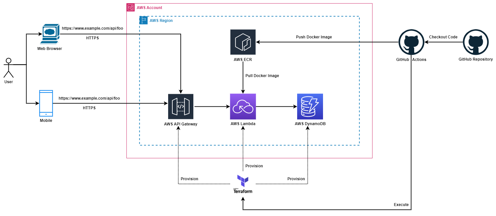

# Stateful Serverless ASP.NET Core API

This project shows how to run an ASP.NET Core Web API project as an AWS Lambda exposed through Amazon API Gateway. The NuGet package [Amazon.Lambda.AspNetCoreServer](https://www.nuget.org/packages/Amazon.Lambda.AspNetCoreServer) contains a Lambda function that is used to translate requests from API Gateway into the ASP.NET Core framework and then the responses from ASP.NET Core back to API Gateway.



### Configuring for API Gateway HTTP API ###

API Gateway supports the original REST API and the new HTTP API. In addition HTTP API supports 2 different
payload formats. When using the 2.0 format the base class of `LambdaEntryPoint` must be `Amazon.Lambda.AspNetCoreServer.APIGatewayHttpApiV2ProxyFunction`.
For the 1.0 payload format the base class is the same as REST API which is `Amazon.Lambda.AspNetCoreServer.APIGatewayProxyFunction`.
**Note:** when using the `AWS::Serverless::Function` CloudFormation resource with an event type of `HttpApi` the default payload
format is 2.0 so the base class of `LambdaEntryPoint` must be `Amazon.Lambda.AspNetCoreServer.APIGatewayHttpApiV2ProxyFunction`.

### Configuring for Application Load Balancer ###

To configure this project to handle requests from an Application Load Balancer instead of API Gateway change
the base class of `LambdaEntryPoint` from `Amazon.Lambda.AspNetCoreServer.APIGatewayProxyFunction` to 
`Amazon.Lambda.AspNetCoreServer.ApplicationLoadBalancerFunction`.

### Project Files ###

* serverless.tf - an Terrafrom file for declaring your Serverless functions and other AWS resources
* LambdaEntryPoint.cs - class that derives from **Amazon.Lambda.AspNetCoreServer.APIGatewayProxyFunction**. The code in this file bootstraps the ASP.NET Core hosting framework. The Lambda function is defined in the base class. Change the base class to **Amazon.Lambda.AspNetCoreServer.ApplicationLoadBalancerFunction** when using an Application Load Balancer.
* LocalEntryPoint.cs - for local development this contains the executable Main function which bootstraps the ASP.NET Core hosting framework with Kestrel, as for typical ASP.NET Core applications.
* Startup.cs - usual ASP.NET Core Startup class used to configure the services ASP.NET Core will use.
* Controllers\HomeController - example API controller

## Packaging as a Docker image.

This project is configured to package the Lambda function as a Docker image. The default configuration for the project and the Dockerfile is to build the .NET project on the host machine and then execute the `docker build` command which copies the .NET build artifacts from the host machine into the Docker image. 

Alternatively the Docker file could be written to use [multi-stage](https://docs.docker.com/develop/develop-images/multistage-build/) builds and have the .NET project built inside the container. Below is an example of building the .NET project inside the image.

```dockerfile
FROM public.ecr.aws/lambda/dotnet:6 AS base

FROM mcr.microsoft.com/dotnet/sdk:6.0-bullseye-slim as build
WORKDIR /src
COPY ["Api.csproj", "Api/"]
RUN dotnet restore "Api/Api.csproj"

WORKDIR "/src/Api"
COPY . .
RUN dotnet build "Api.csproj" --configuration Release --output /app/build

FROM build AS publish
RUN dotnet publish "Api.csproj" \
            --configuration Release \ 
            --runtime linux-x64 \
            --self-contained false \ 
            --output /app/publish \
            -p:PublishReadyToRun=true  

FROM base AS final
WORKDIR /var/task
COPY --from=publish /app/publish .
```
